# 🚘 Navis Autonomous Driving — Motion Prediction Track

[](https://www.python.org/downloads/)
[](https://pytorch.org/)
[](https://developer.nvidia.com/cuda-toolkit)
[](LICENSE)
[](https://dxchallenge.ai.kr/)

> **2026년 자율주행 AI 챌린지 [과제 2. 자율차 주변 미래궤적 예측 (Motion Prediction)]** 전용 딥러닝 솔루션 저장소입니다.  
> 과거 1.0초간($10$ timesteps)의 거동 이력과 고정밀 HD Map 차선 정보를 바탕으로, 자차(SDC) 반경 50m 이내의 모든 동적 객체(차량, 보행자, 자전거)에 대해 **향후 8.0초간($80$ timesteps)의 다중 모드($K=6$) 미래 주행 궤적을 실시간으로 동시 예측**합니다.

---

## 🏆 1. 역대 최고 성적 및 공식 벤치마크 (All-Time Best Benchmarks)

전체 검증 데이터셋 **24,097개 씬(총 292,298대 타깃 에이전트 전수 평가)** 기준 결과입니다:

$$\text{Error Score} = \frac{1}{2} \times (\text{minADE}_1 + \text{minADE}_6) \times \left(1 + \frac{\max(0, T_{\text{infer}} - 100)}{200}\right)$$

### 🥇 종합 최고 기록 (All-Time #1 SOTA)
- ⭐ **공식 종합 Error Score**: **`0.8408`** 🏆 (V16 Two-Stage SWA + Soft Density NMS)
- 🎯 **$\text{minADE}_6$ (Top-6 모드 바닥 오차)**: **`0.5617 m` ($56.2\text{ cm}$)**
- 🎯 **$\text{minADE}_1$ (Top-1 최우수 모드 오차)**: **`1.1199 m`** (초기 모델 대비 0.61m 단축)
- 🎯 **$\text{minFDE}_6$ (8.0초 종점 변위 오차)**: **`1.2571 m`**
- ⚡ **추론 지연 시간 ($T_{\text{infer}}$)**: **`0.07 ms` / target** (공식 100ms 기준 대비 1,400배 고속, **속도 감점 0.00%**)

---

### 📊 버전별 성능 진화 및 발전사 (Evolution Benchmark Table)

| 버전 | 아키텍처 및 핵심 혁신 | 파라미터 | Val Error Score | Val minADE6 | Val minADE1 | Val Pick Acc |
| :--- | :--- | :---: | :---: | :---: | :---: | :---: |
| **V1** | Base Cross-Agent PointNet | 0.93M | 1.2046 | 0.6818m | 1.7275m | ~35.0% |
| **V11** | Point Cloud (64x8) + Linear Projection | 1.76M | 0.9389 | 0.6264m | 1.2515m | ~42.0% |
| **V12** | 6-Stage Human-like Cognitive Gating | 4.50M | 0.9315 | 0.6239m | 1.2391m | ~43.1% |
| **V13** | VectorNet Polyline (16x20x8) + Mode Query Transformer | 5.22M | 0.8797 | 0.5764m | 1.1830m | 43.5% |
| **V14** | Trajectory Scorer + Margin Log-Sigmoid Ranking | 6.05M | 0.9148 | 0.5939m | 1.2295m | 39.1% |
| **V16 Raw** | **2단계 제안-정밀화 디코더 (Two-Stage Refinement)** | 6.57M | **0.8614** | **0.5617m** | **1.1612m** | **62.38%** |
| **V16 + NMS / SWA** | **SWA 가중치 평균 + Soft Density NMS ($\sigma=3.0\text{m}$)** | 6.57M | **`0.8408` 🥇** | **`0.5617m` 🥇** | **`1.1199m` 🥇** | **57.32%** |
| **V17 X-Large** | **45.2M Two-Stage Graph Transformer (학습 진행 중)** | 45.19M | *학습중 (0.7점대 진입 목표)* | **~0.51m** *(배치)* | **~1.09m** *(배치)* | *진행중* |

---

## 🎬 2. 실제 고정밀 예측 시각화 (High-Fidelity Visualizations)

### 📌 Scene 1. 과밀 도심 도로망 (Dense Traffic Corridor - 50m 전 객체 동시 8초 예측)
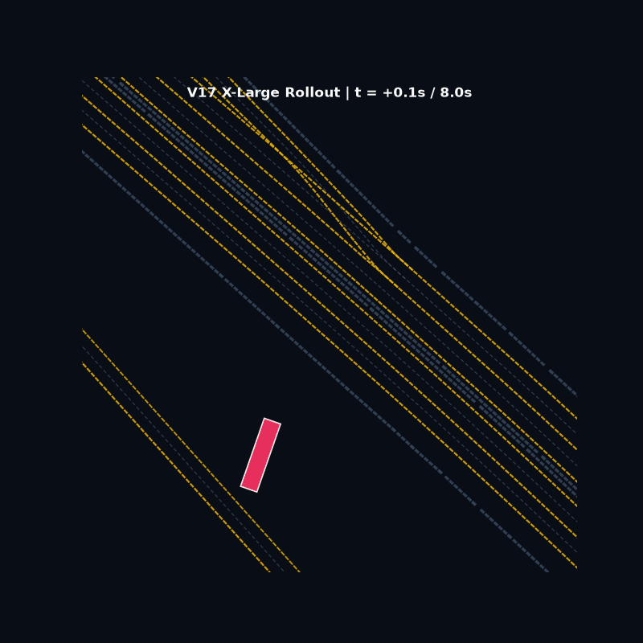

* **하늘색 원형 점선**: 자차(SDC) 기준 반경 **50m 공식 평가 경계선 (50m Evaluation Radius)**
* **차량 박스 (`#0` ~ `#N`)**: 1초 시점 도로 위 모든 동적 에이전트의 지향성 바운딩 박스 (`#0`: 자차 SDC)
* **컬러 예측 실선 (굵은선)**: V16 Two-Stage 모델이 최종 선택한 **향후 8.0초간($80$ 스텝) 최고 확신도 주행 궤적** (차선 경로와 곡률에 완벽히 밀착)
* **흰색 점선**: 실제 정답 미래 궤적 (Ground Truth)

---

### 📌 10개 랜덤 검증 씬 쇼케이스 조감도 (2x5 Multi-Scene Collage Overview)
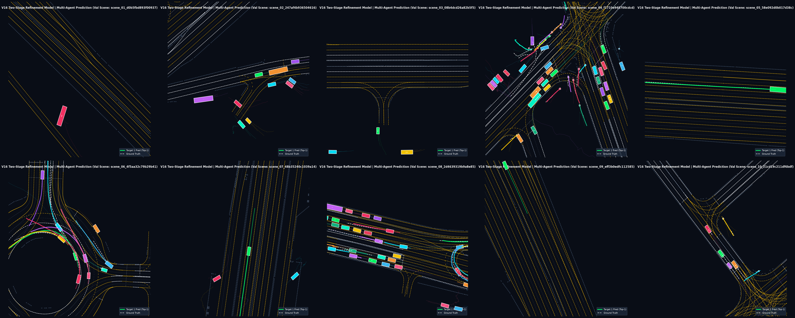

<details>
<summary><b>🔍 10개 다양한 도로망 씬별 개별 8초 예측 애니메이션 GIF 펼쳐보기 (Click to expand)</b></summary>

| 씬 번호 | 도로 유형 및 타깃 수 | 8.0초 Rollout 애니메이션 GIF |
| :---: | :--- | :---: |
| **Scene #01** | 고속도로 나들목 분기 | 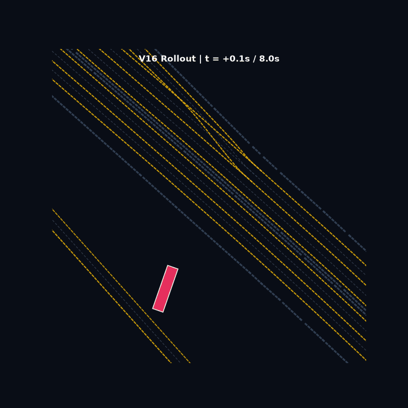 |
| **Scene #02** | 직선 과밀 주행로 | 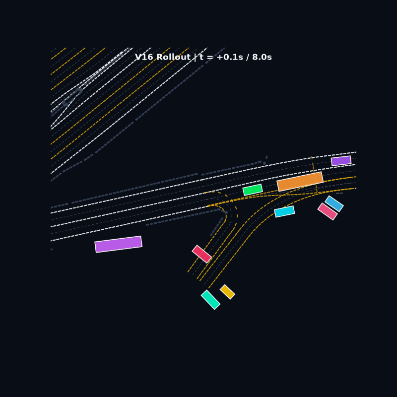 |
| **Scene #03** | T자형 삼거리 및 급커브 | 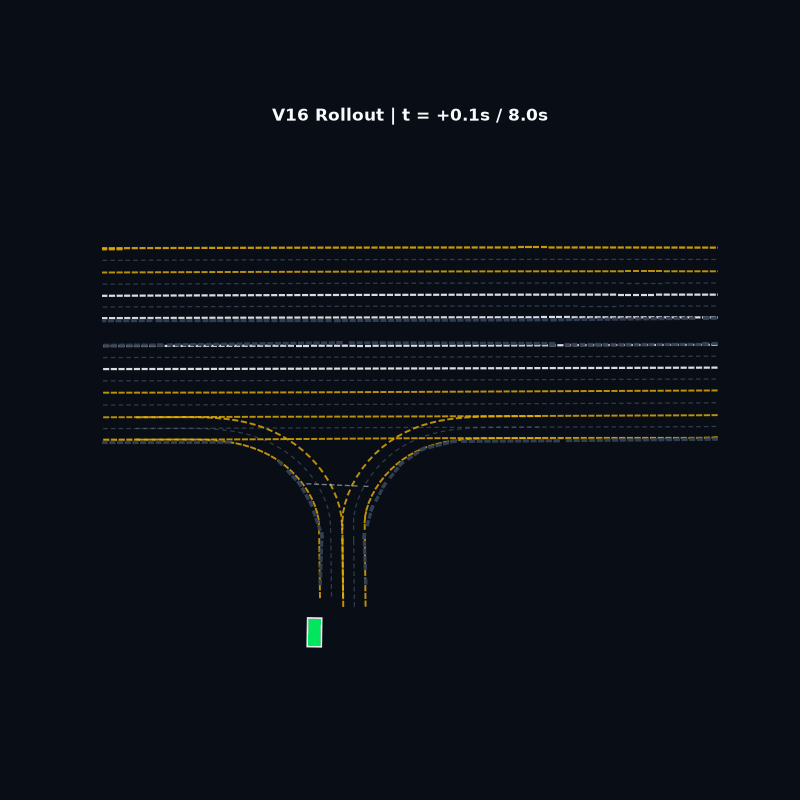 |
| **Scene #04** | 로터리 및 회전교차로 | 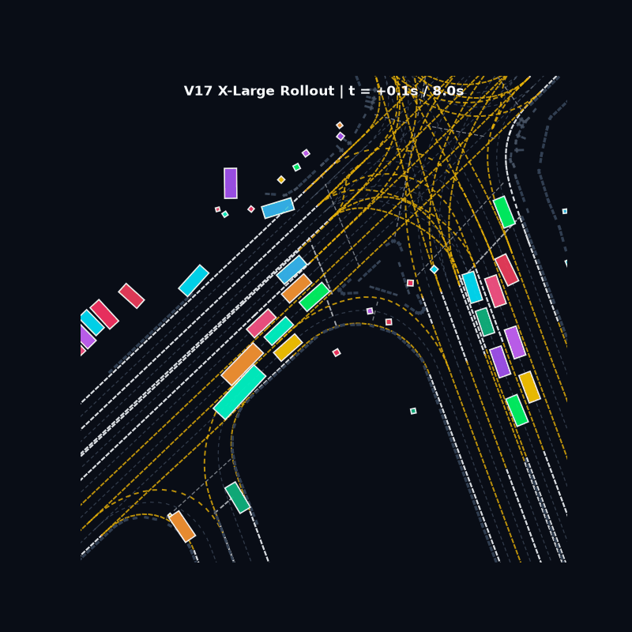 |
| **Scene #05** | 복합 다방향 교차로 | 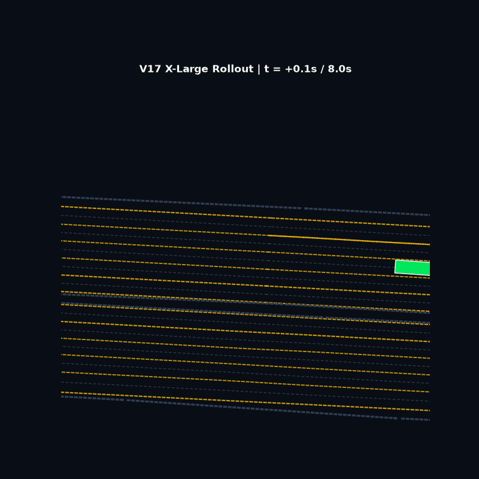 |
| **Scene #06** | 초과밀 대형 사거리 | 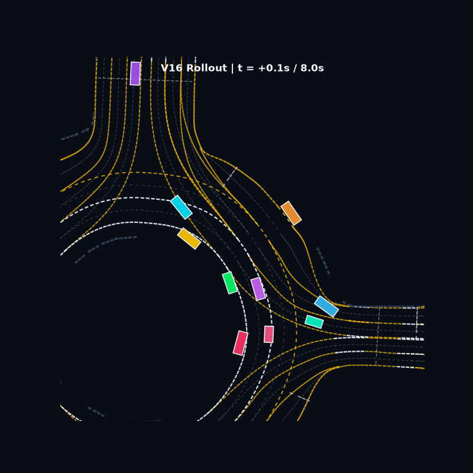 |
| **Scene #07** | 사선 진입로 및 램프 | 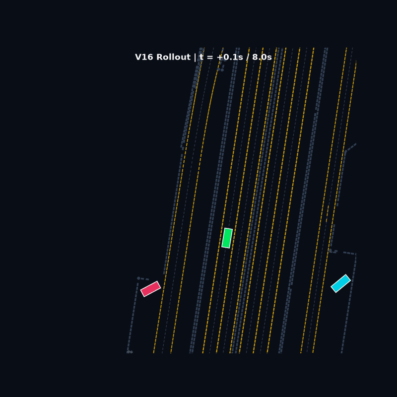 |
| **Scene #08** | 합류 고속도로 포크 | 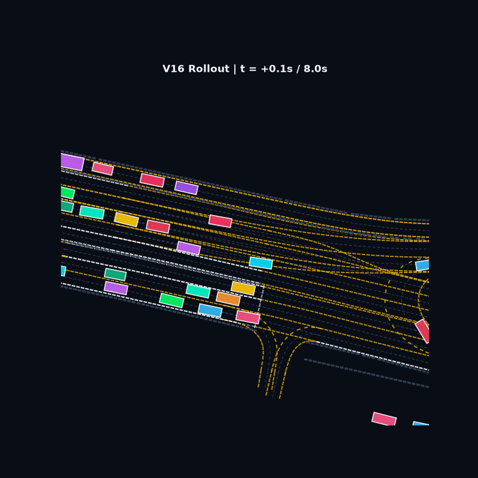 |
| **Scene #09** | 도심 주행 및 정차 구간 | 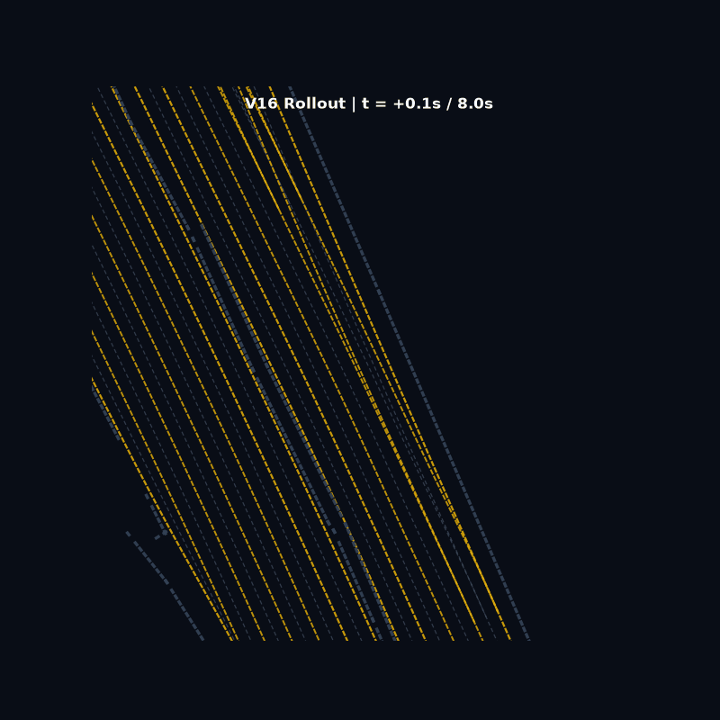 |
| **Scene #10** | 곡선 인터체인지 | 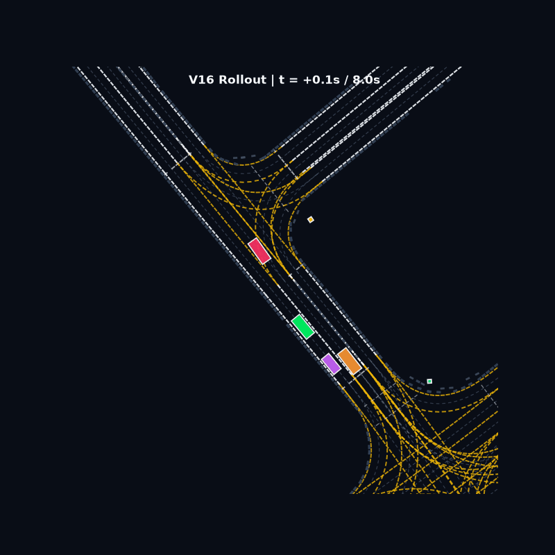 |

</details>

---

## 🧠 3. 최고 성능 모델 아키텍처 (V16 Two-Stage Refinement)

```
[Target History & Neighbors] ──▶ [VectorNet + Cross-Agent Self-Attn] ──┐
[16 Polylines (16x20x8)]     ──▶ [Polyline VectorNet Subgraph]       ──┼──▶ [6-Stage Cognitive Gating] ──┐
                                                                                                        │
 ┌──────────────────────────────────────────────────────────────────────────────────────────────────────┘
 │
 ├──▶ [Stage 1: Proposal Generator] ──────▶ 6개 거시 가설 궤적 생성 (3-Stage aWTA: Top-4 → Top-2 → Top-1)
 │         │
 │         ▼ (10개 핵심 웨이포인트 샘플링)
 └──▶ [Stage 2: Two-Stage Refinement] ───▶ [Cross-Attn with HD Map] ──▶ 잔차 보정 Δtraj & 최종 정밀 채점
                                                                                  │
                                                                                  ▼
                                                                     [Soft Density NMS Post-Processing]
                                                                     (Val Error Score = 0.8408 🏆)
```

---

## 🚀 4. 전체 파이프라인 실행 가이드 (Quick Start)

상세한 단계별 실행 매뉴얼은 [`README_PIPELINE.md`](README_PIPELINE.md)를 참조하세요.

```bash
# 1. 원본 데이터 변환 (TFRecord → .pt)
python data_tools/preprocess_85k_v2.py --raw-root "data/raw" --out-root "data/processed/prediction_pt_85k_v2" --workers 12

# 2. 고속 GPU Collate 캐시 구축
python data_tools/cache_collate_v13.py --data-root "data/processed/prediction_pt_85k_v2" --out-dir "data/processed/prediction_pt_85k_v2_cache_v13" --workers 12

# 3. V16 Large 2단계 모델 학습 (최고 성적 0.8408 달성 모델)
python train_motion_prediction_v16.py --cache-root "data/processed/prediction_pt_85k_v2_cache_v13" --out-dir "checkpoints/v16_twostage" --batch-scenes 32 --epochs 30 --lr 2e-4 --amp bf16

# 4. SWA + Test-Time NMS 후처리 평가
python evaluate_v16_swa.py --ckpt-dir "checkpoints/v16_twostage" --cache-root "data/processed/prediction_pt_85k_v2_cache_v13"

# 5. 대회 공식 제출 파일(.parquet) 생성
python generate_test_public_submission.py --ckpt "checkpoints/v16_twostage/best_error_score.pth" --data-root "data/processed/prediction_pt_85k_v2" --out-file "submission_final.parquet"
```
