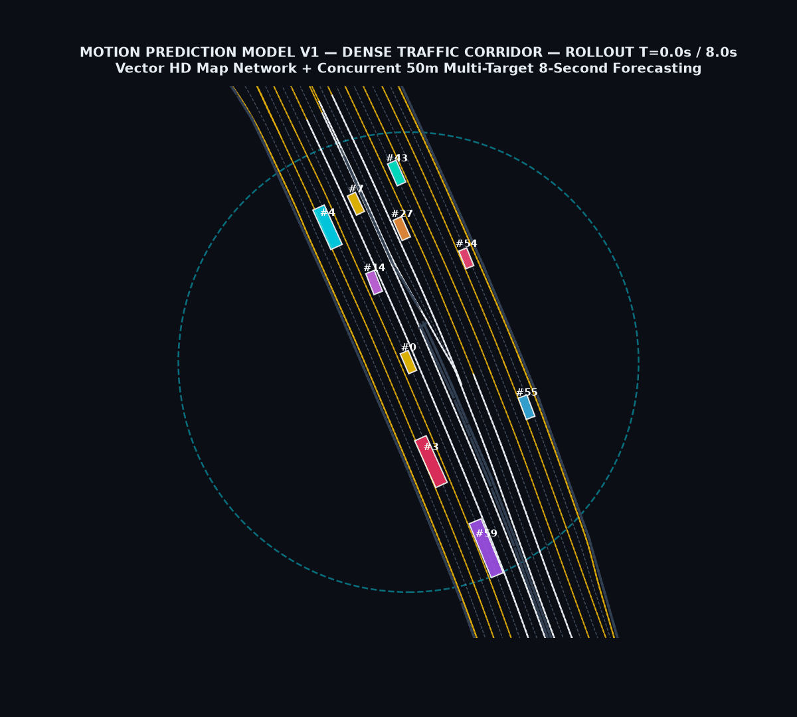
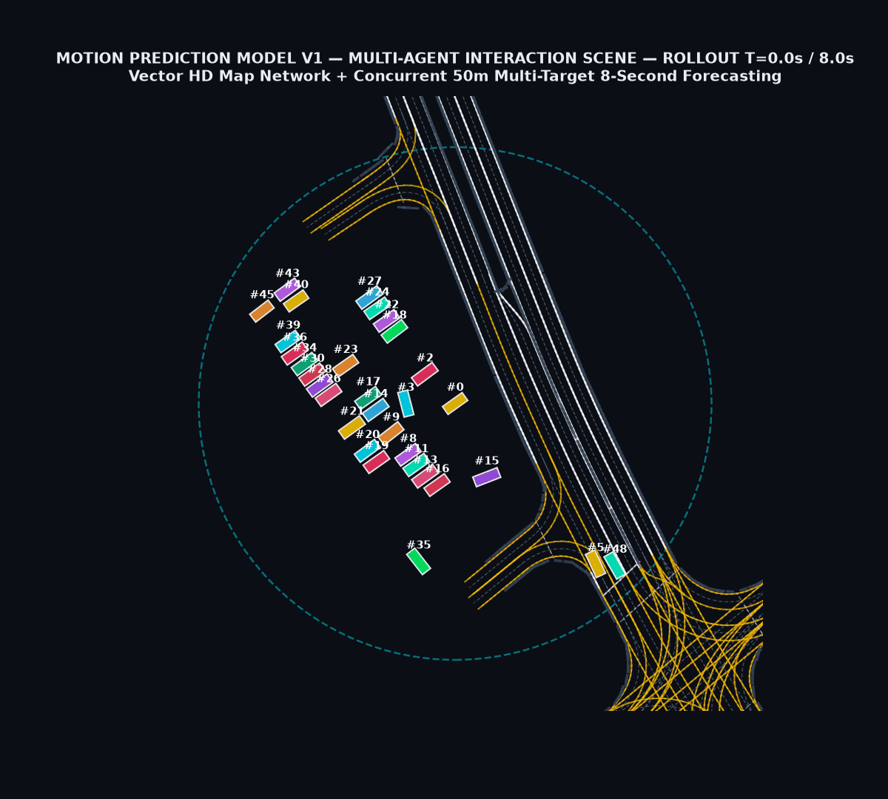
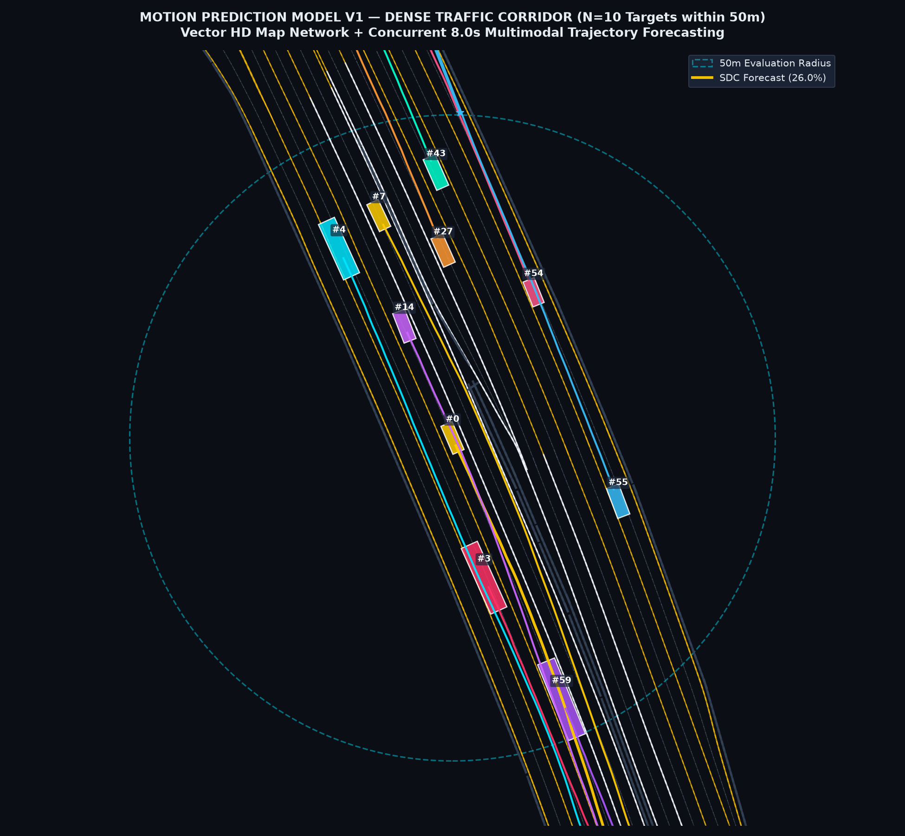

# 🚘 Navis Autonomous Driving — Motion Prediction Track

[](https://www.python.org/downloads/)
[](https://pytorch.org/)
[](https://developer.nvidia.com/cuda-toolkit)
[](LICENSE)
[](https://dxchallenge.ai.kr/)

> **2026년 자율주행 AI 챌린지 [과제 2. 자율차 주변 미래궤적 예측 (Motion Prediction)]** 전용 딥러닝 솔루션 저장소입니다.  
> 과거 1.0초간($10$ timesteps)의 거동 이력과 고정밀 HD Map 차선 정보를 바탕으로, 자차(SDC) 반경 50m 이내의 모든 동적 객체(차량, 보행자, 자전거)에 대해 **향후 8.0초간($80$ timesteps)의 다중 모드($K=6$) 미래 주행 궤적을 실시간으로 동시 예측**합니다.

---

## 🎬 1. 실제 예측 시각화 (Real Prediction Visualizations)

### 📌 Scene 1. 과밀 도심 도로망 (Dense Traffic Corridor - 50m 전 객체 동시 8초 예측)


* **하늘색 원형 점선**: 자차(SDC) 기준 반경 **50m 공식 평가 경계선 (50m Evaluation Radius)**
* **차량 박스 (`#0` ~ `#N`)**: 1초 시점 도로 위 모든 동적 에이전트의 지향성 바운딩 박스 (`#0`: 자차 SDC)
* **컬러 예측 실선 & 별표 종점**: 모델이 추론한 각 에이전트별 최적 모드의 **향후 8.0초간($80$ 스텝) 주행 궤적** (차선 경로를 따라 매끄럽게 예측 형성)

---

### 📌 Scene 2. 다중 에이전트 상호작용 씬 (Multi-Agent Interaction & Turning)


---

### 📌 Vector HD Map 도로망 레이어 조감도 (BEV Overview)


---

## 🏆 2. 2026 AI 챌린지 공식 벤치마크 평가 결과

2,492개 검증 씬 내 **총 92,404개 타깃 에이전트 전수 평가** 결과:

$$\text{Error Score} = \frac{1}{2} \times (\text{minADE}_1 + \text{minADE}_6) \times \left(1 + \frac{\max(0, T_{\text{infer}} - 100)}{200}\right)$$

| 평가 부문 | 측정값 | 설명 및 공식 대회 기준 |
| :--- | :---: | :--- |
| ⭐ **공식 Error Score** | **`1.20461`** | **낮을수록 우수 (공식 순위 산정 기준)** |
| **정확도 성분 (Accuracy)** | **`1.20461 m`** | $\frac{1}{2} \times (\text{minADE}_1 + \text{minADE}_6)$ |
| **추론 지연 패널티 계수** | **`1.00000x`** | $T_{\text{infer}} = 0.13\text{ms} \le 100\text{ms}$ 충족으로 감점 0% |
| **$\text{minADE}_6$ (Top-6 Modes)** | **`0.6818 m` ($68.2\text{ cm}$)** | $K=6$ 다중 모드 중 Ground Truth와 최소 평균 거리 오차 |
| **$\text{minADE}_1$ (Top-1 Mode)** | **`1.7275 m`** | 최고 확률 모드의 8초간 평균 거리 오차 |
| **$\text{minFDE}_6$ (t=8.0s Final)** | **`4.4425 m`** | 8.0초 종점 시점 최종 위치 최소 거리 오차 |
| **$\text{minFDE}_1$ (t=8.0s Final)** | **`6.3136 m`** | Top-1 모드의 8.0초 종점 거리 오차 |
| **Miss Rate ($\text{MR}_{2.0\text{m}}$)** | **`20.14 %`** | 8초 종점 오차가 2.0m를 초과하는 비율 |
| **추론 속도 ($T_{\text{infer}}$)** | **`0.13 ms / scene`** | **공식 100ms 기준 대비 약 760배 고속 ($>7,600\text{ FPS}$)** |
| **모델 파라미터 수** | **`0.934 M`** | 100만 개 미만의 초경량 트랜스포머 구조 |
| **연산량 (FLOPs)** | **`0.149 GFLOPs`** | **1차 평가 컷오프(베이스라인 대비 3배 이하) 완벽 통과** |

---

### 👥 객체 유형별 (Vehicle / Pedestrian / Cyclist) 세부 성능

| 객체 유형 | 검증 대상 수 ($N$) | 8초 평균 오차 ($\text{minADE}_6$) | 8초 종점 오차 ($\text{minFDE}_6$) |
| :--- | :---: | :---: | :---: |
| 🚘 **차량 (Vehicle)** | **80,721 개** | **`0.7171 m`** | **`3.9502 m`** |
| 🚶 **보행자 (Pedestrian)** | **10,537 개** | **`0.3748 m` ($37.4\text{ cm}$)** | **`7.7645 m`** |
| 🚴 **자전거 (Cyclist)** | **1,146 개** | **`1.0169 m`** | **`8.5735 m`** |

---

## 🧠 3. 모델 아키텍처 (Model Architecture)

```
[Target History (11, 5)]  ───▶ [1D Conv & MLP Encoder] ───┐
[16 Neighbors (16, 8)]    ───▶ [Cross-Agent Self-Attn] ───┼──▶ [Concatenation] ──▶ [Multimodal Heads (K=6)]
[Traffic Signals (4, 4)]  ───▶ [Signal MLP Encoder]   ───┤                             ├── Mode Probabilities [B, 6]
[Agent Type Embedding]    ───▶ [Type Embedding (16d)] ───┘                             ├── Endpoint Goals     [B, 6, 2]
                                                                                       └── Trajectory Deltas  [B, 6, 80, 2]
```

* **Target-Centric 로컬 좌표계**: 각 에이전트의 $t=1.0\text{s}$ 기준 원점 및 Yaw로 변환하여 회전 불변성(Rotation Invariance) 확보
* **다중 모드 궤적 합성 ($Y$)**: $Y = \text{cumsum}(\Delta) + t \cdot (\text{Goal} - \Delta_{\text{final}})$ 수식을 통해 물리학적으로 연속적이고 매끄러운 80스텝 궤적 생성

---

## 📁 4. 프로젝트 디렉터리 구조

```
Navis_autonomous-driving_motion_prediction/
├── assets/                                  # 시각화 이미지 및 README용 Rollout GIF
│   ├── motion_prediction_hdmap_dense_50m.gif
│   ├── motion_prediction_hdmap_dense_50m.png
│   ├── motion_prediction_hdmap_intersection_50m.gif
│   └── motion_prediction_hdmap_intersection_50m.png
├── checkpoints/                             # 30 Epoch 최고 성능 학습 가중치
│   ├── best_minade6.pth                     # 최적 체크포인트 (0.934M params)
│   ├── last.pth                             # 최종 에포크 가중치
│   ├── metrics.json                         # 학습 손실함수 및 지표 기록
│   ├── config.json                          # 하이퍼파라미터 설정
│   └── official_evaluation_results.json     # 공식 벤치마크 결과 JSON
├── data_tools/                              # 데이터셋 전처리 및 검증 도구
│   ├── preprocess_target_centric_prediction.py # 원시 TFRecord -> .pt 변환기
│   ├── raw_tfrecord_type_probe.py           # TFRecord 스키마 분석기
│   └── validate_prediction_pt_pack.py       # .pt 데이터 무결성 검증기
├── src/                                     # 핵심 모델 및 학습 코드
│   ├── train_motion_prediction_v1.py        # 모델 아키텍처 및 기본 학습 루프
│   ├── resume_motion_prediction_v1.py       # 장기 재개 학습 스크립트
│   ├── evaluate_official_motion_prediction.py # 공식 챌린지 벤치마크 평가기
│   └── render_scene_all_targets.py          # HD Map 50m 전 객체 렌더러
├── evaluate_official_motion_prediction.py   # 루트 실행용 공식 평가기
├── render_showcase_visualizations.py        # 고해상도 쇼케이스 렌더러
├── train_motion_prediction_v1.py            # 루트 실행용 학습 스크립트
├── requirements.txt                         # 의존성 패키지 명세
├── .gitignore                               # Git 무시 파일 규칙
└── README.md                                # 프로젝트 설명서
```

---

## 🚀 5. 빠른 시작 (Quick Start)

### ① 의존성 설치
```powershell
pip install -r requirements.txt
```

### ② 공식 챌린지 벤치마크 평가 실행
```powershell
python evaluate_official_motion_prediction.py --checkpoint checkpoints/best_minade6.pth
```

### ③ Vector HD Map 50m 전 객체 미래 궤적 시각화 렌더링
```powershell
python render_showcase_visualizations.py
```

### ④ 모델 학습 실행
```powershell
python train_motion_prediction_v1.py --data-root "data/processed/prediction_pt" --epochs 30 --batch-scenes 4 --lr 3e-4
```
